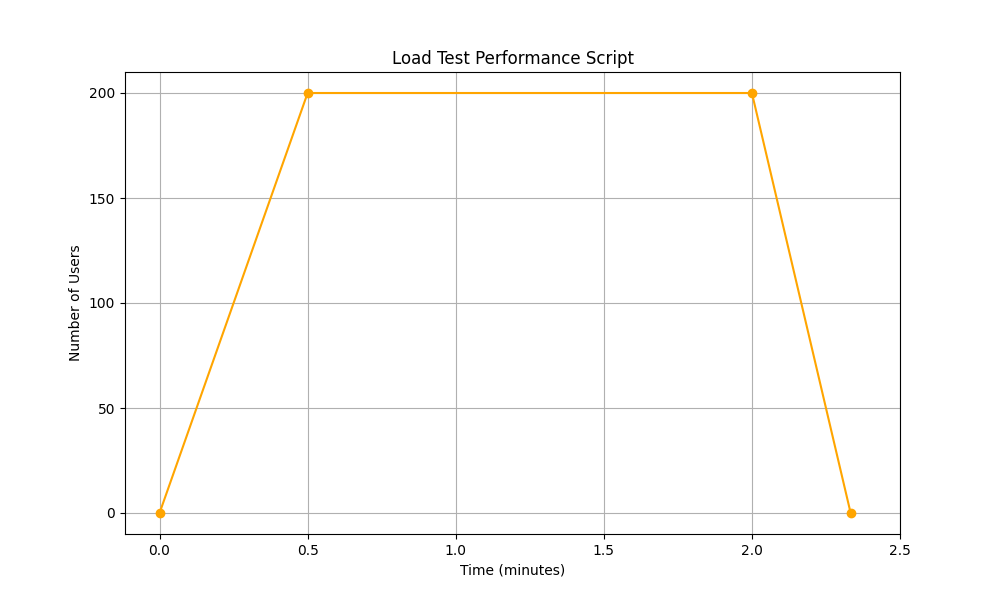
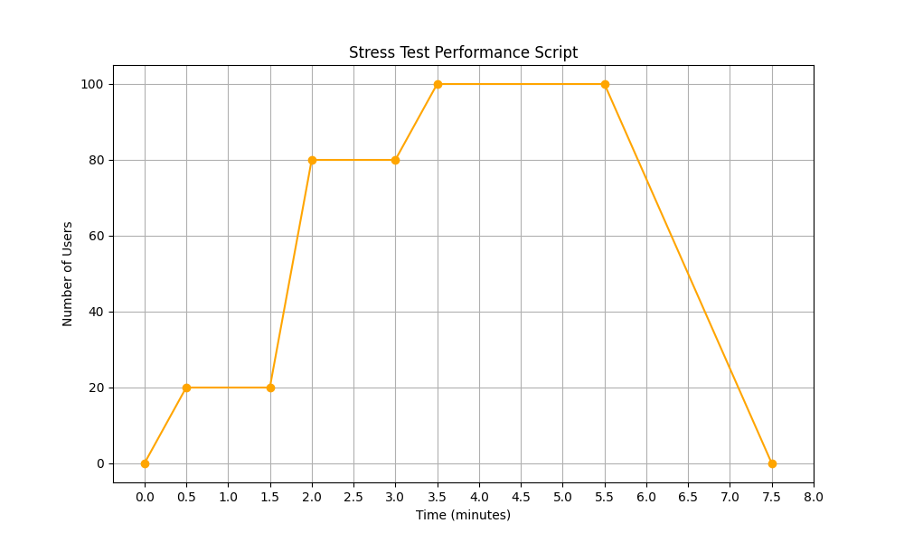
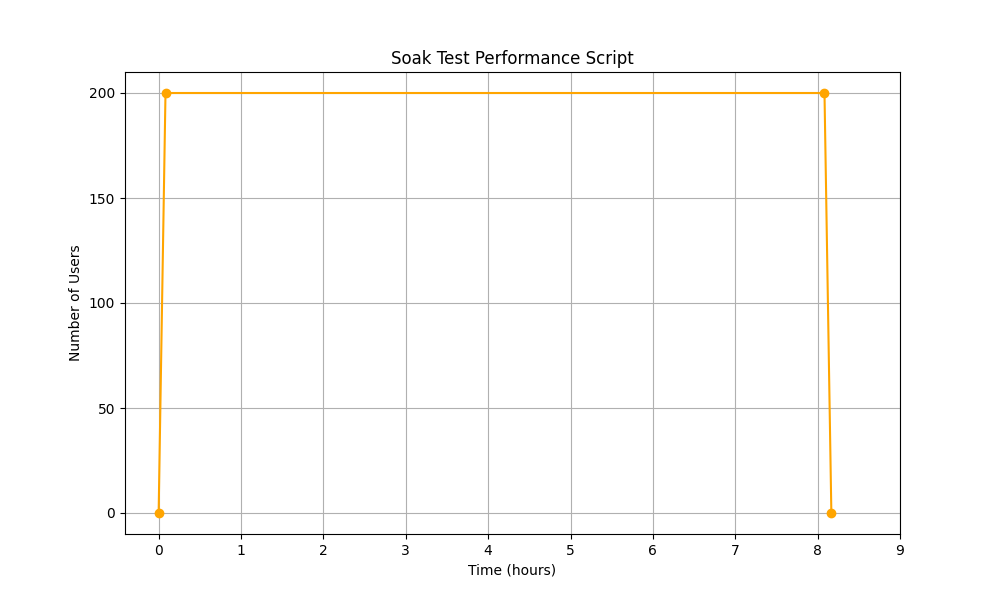

# Preformance Test on OMS with K6

## Description
 k6 is an open-source load testing tool that makes performance testing easy and productive for platform engineering teams.

Using k6 on OMS, so we can test the reliability and performance of our systems and catch performance regressions and problems earlier. k6 will help to build resilient and performant OMS microservices that scale..

## Performance Testing types on OMS

**Load Test**: Targets the system under normal usage by the users. You should ask: “How many users are using the system simultaneously typically, and how long will their sessions last?



**Stress Test**: What is the maximum capacity of the system? How many users with what kind of behavior should use the site to disrate its quality due to the SLO: i.e., availability, request latency, throughput, etc.



**Soak Test**: Would the system sustain for a long time(generally from hours to days) under normal conditions? It’s working for 15min under typical conditions in the load test but is it feasible for a much longer time?



**Spike Test**: a very quick ramp up of traffic that lasts a short amount of time before quickly dying down.
we quickly increase traffic by req/s, and then quickly drop back down again.


## Installation
To install k6 on windows, run the following command:
```bash
choco install k6
``` 

## Running 
To run a script : 
```bash
k6 run simple.js
``` 

Note : This tests are testing one endpoint in product ms